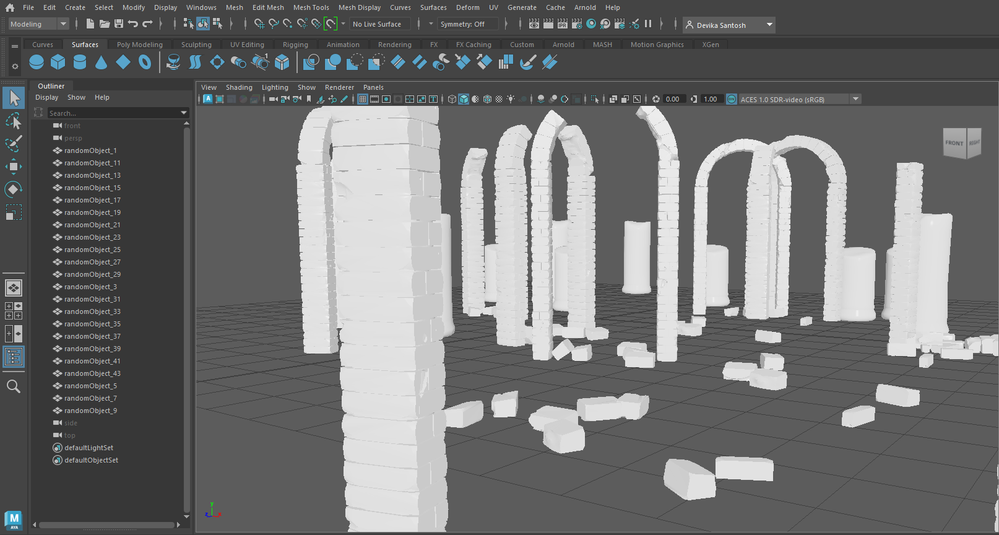

# TECHNICAL ANIMATION
## Archeological Ruins Generator
Software: Maya
Language: Python

Created using Maya and Python scripting, this script allows the artist to generate an archeological ruins scene by selecting 3D models of arches and pillars with varying levels of decay, and setting the number of 3D models and their relative distance.

  
YouTube demonstration:

[Youtube Link](https://www.youtube.com/watch?v=lyud-Rm00XU)
